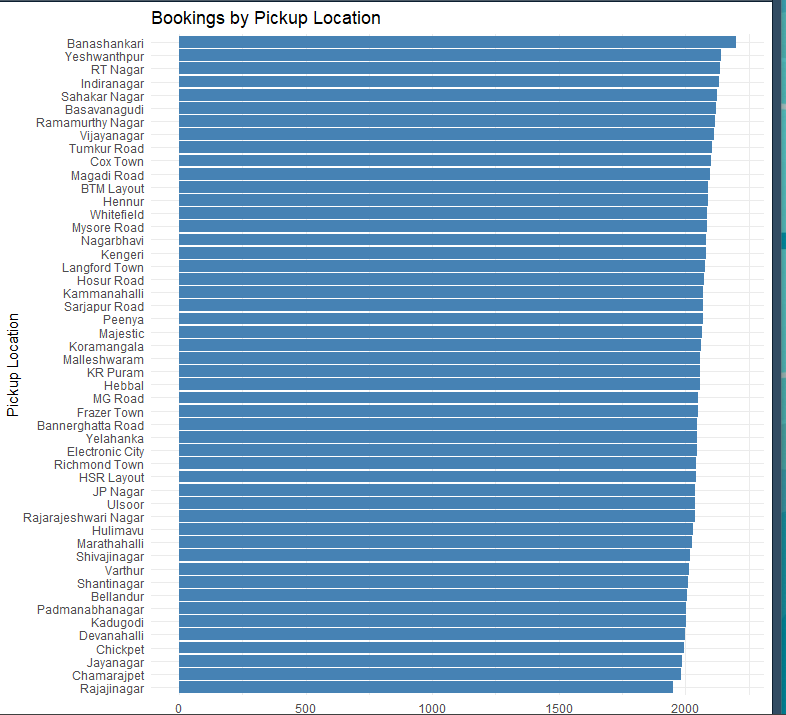

# Dashboard Results Analysis
## 1. Overall KPI Dashboard

The KPI dashboard provides an overall summary of the ride-booking platform after data cleaning and integration. It presents key operational indicators such as total bookings, completed rides, cancelled bookings, total revenue, average booking value, and average ride distance. These indicators allow managers to quickly evaluate the current operational performance without examining individual booking records.

The dashboard shows that the platform successfully handled a large number of ride requests, while completed bookings accounted for the majority of transactions. Although cancellations still exist, the overall operational performance remains stable. These KPIs provide a solid foundation for monitoring business performance and identifying areas requiring further operational improvement.

## 2. Booking Trend Analysis

The Booking Trend chart illustrates how booking demand changes over time. Instead of remaining constant, booking volume fluctuates throughout the observation period, indicating that customer demand varies according to different time periods.

Several noticeable peaks can be observed, suggesting periods of higher transportation demand. Such demand fluctuations may be associated with commuting hours, weekends, public holidays, or promotional activities. During these peak periods, additional drivers should be allocated to reduce passenger waiting time and improve service availability.

Conversely, lower booking periods provide opportunities for optimising driver scheduling and reducing unnecessary operational costs. Continuous monitoring of booking trends enables management to balance customer demand with available transportation resources more efficiently.

## 3. Revenue by Vehicle Type Analysis

The Revenue by Vehicle Type chart compares the financial contribution of different vehicle categories. Premium vehicle services generally contribute higher revenue per completed booking because of their higher fare structure, whereas economy vehicles contribute through a larger booking volume.

This finding suggests that overall business revenue depends on both pricing strategy and customer demand. Maintaining a balanced vehicle portfolio allows the platform to serve different customer segments while maximising profitability. Promotional campaigns encouraging customers to upgrade to premium vehicle categories may further increase average booking value without substantially increasing operating costs.

## 4. Booking Status Analysis

The distribution of bookings across pickup locations is relatively balanced, with only slight variations in booking volume. Areas such as **Banashankari**, **Yeshwanthpur**, and **RT Nagar** record the highest number of pickups, while **Rajajinagar**, **Chamarajpet**, and **Jayanagar** have slightly lower totals. Overall, the chart indicates that ride demand is well distributed across different regions, suggesting broad service coverage without significant geographical concentration.

## 5. Payment Method Analysis

The payment method distribution provides insights into customer payment preferences. The dashboard indicates that customers actively use both traditional cash payments and digital payment methods such as UPI and credit cards.

The increasing adoption of electronic payments benefits both customers and the platform by providing faster transactions, reducing cash-handling risks, and improving financial record management. Future promotional campaigns targeting digital payment users could further improve operational efficiency and customer convenience.

## 6. Customer and Driver Rating Analysis

Customer and driver ratings provide an important measure of service quality. The dashboard indicates that most completed rides receive relatively high ratings, reflecting generally positive customer experiences.

Nevertheless, a small proportion of lower ratings suggests that service quality can still be improved. Possible contributing factors include waiting time, driver professionalism, vehicle condition, and communication quality. Continuous monitoring of rating trends allows management to identify underperforming drivers and implement appropriate training programmes to maintain service standards.

## 7. Cancellation Reason Analysis

The cancellation reason analysis identifies the major factors contributing to unsuccessful bookings. Customer cancellations are commonly associated with changes in travel plans, incorrect addresses, or service-related issues, whereas driver cancellations frequently result from personal reasons, vehicle problems, or customer-related concerns.

Understanding these cancellation patterns enables management to implement targeted improvement strategies. For example, improving driver assignment algorithms, providing clearer pickup instructions, and enhancing communication between drivers and customers may effectively reduce cancellation frequency.

## 8. Logistic Regression Prediction Analysis

The Logistic Regression model extends the dashboard from descriptive analytics to predictive analytics by estimating the likelihood of booking cancellation. Instead of only analysing historical data, the model provides early identification of potentially high-risk bookings.

This predictive capability enables platform operators to intervene before cancellations occur by reallocating drivers, sending booking confirmations, or offering customer incentives. As a result, the prediction model enhances operational decision-making and demonstrates the practical value of integrating machine learning into ride-booking management systems.

Although Logistic Regression provides good interpretability, future research could evaluate more advanced machine learning algorithms to further improve prediction accuracy.

## 9. Overall Business Insights

The dashboard demonstrates that the cleaned dataset can be transformed into meaningful business intelligence through interactive visualisation and predictive analytics. The analysis highlights several important operational characteristics of the ride-booking platform. Firstly, booking demand varies over time, requiring flexible driver allocation strategies. Secondly, different vehicle categories contribute differently to total revenue, indicating opportunities to optimise pricing and fleet management. Thirdly, while customer satisfaction is generally high based on rating distributions, booking cancellations continue to represent a major operational challenge. Finally, the integration of predictive analytics provides valuable decision support by enabling management to identify potential risks before bookings are completed.
